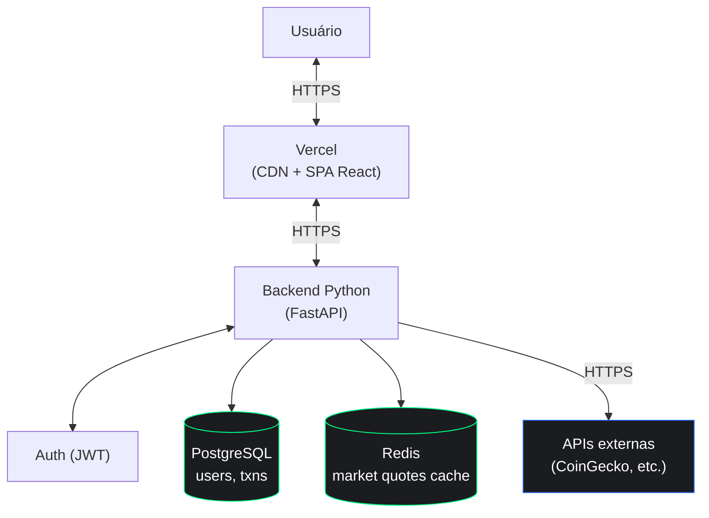

# Crypto Planet

> SPA para monitoramento de criptomoedas e gestão simulada de portfólio.

- **Demo:** [`kryptoplanet.vercel.app`](https://kryptoplanet.vercel.app)
- **Credenciais:** `admin@email.com` / `admin`

---

## Estado atual

A persistência ocorre em `localStorage`, com a camada `auth.storage.utils` isolando o acesso. Trata-se de decisão de fase, não permanente: enquanto o frontend é estabilizado, a ausência de backend permite tratar com profundidade temas que costumam ficar superficiais em projetos _full-stack_  gerenciamento de estado em React, padrões de derivação versus espelhamento, separação entre contexto de autenticação e estado de página, e testes que travam contrato comportamental sem acoplar implementação.

O ciclo recente de manutenção endereçou as quatro violações do `eslint-plugin-react-hooks` 7.x (PRs #54, #55 e #56), todas protegidas por suíte de regressão introduzida em #53. Nenhum teste precisou ser alterado durante as três refatorações consecutivas.

## Arquitetura

Topologia ainda em definição. Backend pode usar FastAPI ou Django; banco e infraestrutura serão decididos ao iniciar a fase de implementação. O escopo inicial cobre autenticação real (substituindo `localStorage`), persistência de portfólio em banco relacional, e proxy com cache para APIs públicas de mercado de criptomoedas.



---

## Stack

React 19, React Router 7, TypeScript 5.6 em modo `strict`, Vite 6, Tailwind CSS 4, TanStack Table 8, Recharts 2.15, Vitest com Testing Library e jsdom, ESLint 9, Vercel.

---

## Fluxo de Trabalho

O projeto adota Gitflow. As branches `main` e `develop` são de longa duração; as `feature/*` partem de `develop` e nela são integradas via PR; as `release/*` e `hotfix/*` são reservadas para os fluxos canônicos. Os merges utilizam commit dedicado (`--no-ff`) para preservar o contexto da feature branch.

> Os commits seguem [Conventional Commits](https://www.conventionalcommits.org/).

---

## Setup

```bash
git clone git@github.com:fabiodelllima/crypto-planet-frontend.git
cd crypto-planet-frontend/crypto-planet
npm install && npm run dev
```

Requer Node 22.x (ver `.nvmrc`).

---

## Roadmap

1. **CI no GitHub Actions.** Executar `test:run` e `build` em cada PR.
2. **Backend Python.** Implementação do escopo descrito acima.
3. **Refatoração do `AuthContext`.** Expor `refreshUser` para eliminar o slot otimista do `PortfolioPage`.
4. **Validação de schema.** Zod no frontend, alinhado com Pydantic do backend.
5. **Cobertura de testes dos componentes-base.** `Button`, `Input` e `Select`.
6. **`npm audit`.** Vulnerabilidades pendentes a auditar.
7. **Code-splitting.** _Bundle_ principal ultrapassa 500 kB; avaliar `manualChunks`.
